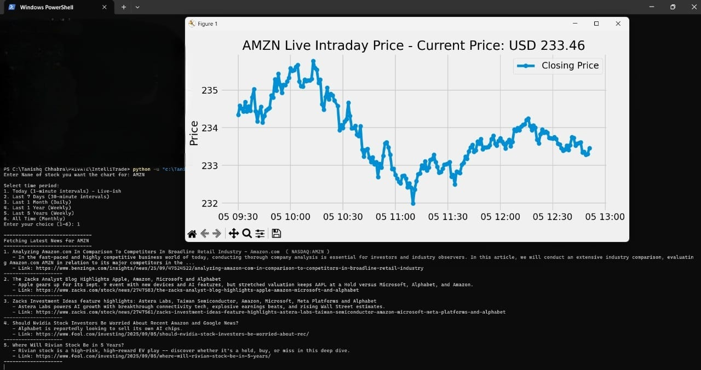

# 🤖 IntelliTrade – AI-Powered Trading Assistant

Driven by a passion for automated finance, IntelliTrade is a personal long-term project aimed at leveraging AI to provide intelligent, data-driven suggestions to a human trader. It is a companion to help analyze and interpret stock market data, not an automated system for guaranteed profit.

This project is in active development, with a focus on building a robust backend for data fetching, analysis, and visualization.

---

🚀 Features Implemented So Far
    ✅ Modular & Scalable Architecture: The project has been refactored into a clean src/ directory with dedicated modules for data fetching, analysis, and plotting.
    ✅ Advanced Technical Indicators: Can calculate and plot a Simple Moving Average (SMA), Exponential Moving Average (EMA), and the Relative Strength Index (RSI).
    ✅ Dynamic Data Visualization: Plots a live-updating intraday graph and static charts for user-selected time periods (day, week, month, year).
    ✅ Live Data & News Integration: Fetches live-ish intraday price data and displays the latest financial news and sentiment from a news API.
    ✅ Currency Handling: Automatically detects and displays the correct currency (e.g., USD, INR) for the selected stock.
    ✅ Multi-threading for Performance: Uses multi-threading to fetch news articles simultaneously while the graphs are being plotted, providing a smoother user experience.
  

    
---

## 📊 Sample Output



---

## 🧰 Tech Stack


---

## 🛣️ Roadmap

[ ] Add support for candlestick charts.

[ ] Implement custom date range selection for data fetching and plotting.

[ ] Implement machine learning for price prediction.

[ ] Implement portfolio and budgeting logic to track mock investments.

[ ] Connect to a real broker API for live or paper trading (simulated trading).

{ ] Build a full web dashboard (possibly with Flask or React).

---

## 🛠️ How to Run

To get IntelliTrade up and running on your local machine, follow these steps:

1.  **Clone the repository:**
    ```bash
    git clone [https://github.com/Tanishq4258/IntelliTrade.git](https://github.com/Tanishq4258/IntelliTrade.git)
    cd IntelliTrade
    ```

2.  **(Optional but Recommended) Create and activate a Python virtual environment:**
    Using a virtual environment helps isolate your project's dependencies and prevents conflicts with other Python projects.
    ```bash
    python -m venv venv
    # On Windows:
    .\venv\Scripts\activate
    # On macOS/Linux:
    source venv/bin/activate
    ```

3.  **Install the required libraries:**
    Ensure you have a `requirements.txt` file in your project's root directory.
    Then, install them using pip:
    ```bash
    pip install -r requirements.txt
    ```

4.  **Run the application:**
    
    To run the stock chart plotter:
    ```bash
    python src/graph_fetcher.py
    ```
    To run the live price fetcher:
    ```bash
    python src/stock_price_fetcher.py
    ```
    Follow the on-screen prompts to enter stock symbols.

---

## 👨‍💻 Author

Tanishq Chhabra
Just getting started. IntelliTrade may take months or years to complete — but it’s happening. 🚀

---

## 📌 License

**All rights reserved.**

This is a personal project by Tanishq Chhabra. You may not copy, modify, distribute, or reuse any part of this code or content without explicit written permission from the author.
